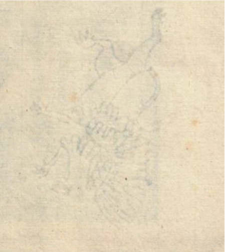

# Pierre de Montmartre, D. Petri venerabilis, ... Opera

## Description

[watermark](https://books.google.ca/books/content?id=H0Kom9s7aSIC\&pg=PP5\&img=1\&zoom=3\&hl=en\&sig=ACfU3U0gXg3946\_ciBFaCQphqApuGuU2mA\&ci=283%2C654%2C273%2C221\&edge=0)

.png>)

## Facsimiles

[Google Books](https://books.google.ca/books?id=H0Kom9s7aSIC\&printsec=frontcover\&source=gbs\_ge\_summary\_r\&cad=0#v=onepage\&q\&f=false)

## Contents:&#x20;

Work relating to Peter of Poitiers

1. [Foreward by Brother Peter of Montmartre](https://books.google.ca/books?id=H0Kom9s7aSIC\&pg=PP8#v=onepage\&q\&f=false) \[ā i verso]
2. [Epistola Petri Pictauiensis ad dominum Petrum Abbatem Cluniacensis](https://books.google.ca/books?id=H0Kom9s7aSIC\&pg=PP10#v=onepage\&q\&f=false) \[ā ij verso]
3. [Panigericon Petri Pictuiensis](https://books.google.ca/books?id=H0Kom9s7aSIC\&pg=PP11#v=onepage\&q\&f=false) \[ā iij recto]
4. [Petri Pictaiuensis ad calumpniatorem carminum suorum](https://books.google.ca/books?id=H0Kom9s7aSIC\&pg=PP16#v=onepage\&q\&f=false) \[ā vi recto]
5. [Aduersus Barbarum](https://books.google.ca/books?id=H0Kom9s7aSIC\&pg=PP17#v=onepage\&q\&f=false) by Peter the Venerable
6. [Privilegium](https://books.google.ca/books?id=H0Kom9s7aSIC\&pg=PP21#v=onepage\&q\&f=false) (signed L. Ruze)

Works of Peter the Venerable

1. [Epistola Petri Pictauiensis ad dominum Petrum Abbatem Cluniacensis](https://books.google.ca/books?id=H0Kom9s7aSIC\&pg=PP23#v=onepage\&q\&f=false)
2. [Additional note by Brother Peter of Montmartre](https://books.google.ca/books?id=H0Kom9s7aSIC\&pg=PP24#v=onepage\&q\&f=false)
3. [Epistolae Petri Venerabilis](https://books.google.ca/books?id=H0Kom9s7aSIC\&pg=PP25#v=onepage\&q\&f=false)
4. [Rithmi Petri Venerabilis](https://books.google.ca/books?id=H0Kom9s7aSIC\&pg=PP426#v=onepage\&q\&f=false)
5. [Libri duo de miraculis](https://books.google.ca/books?id=H0Kom9s7aSIC\&pg=PP431#v=onepage\&q\&f=false) \[28 fol.]
6. [Indicis in sex libros Epistolarum Petri Venerabilis finis](https://books.google.ca/books?id=H0Kom9s7aSIC\&pg=PP487#v=onepage\&q\&f=false) \[✠i -✠iv]
7. Arrest du Grand Conseil du Roy portant reglements ... 1236. (in one version from the Austrian National Library - code BE.1.J.20)

