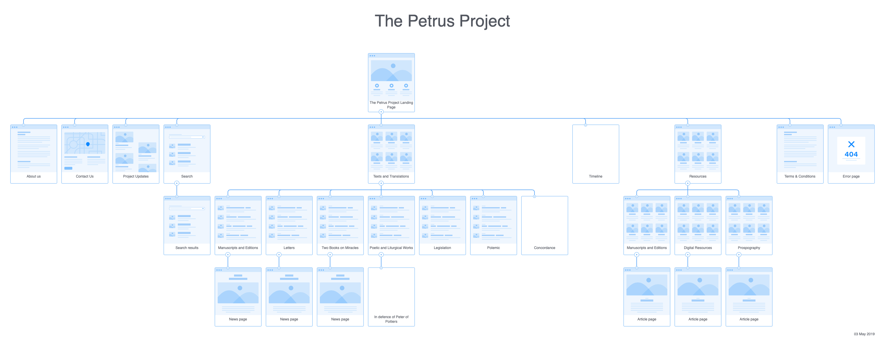

# The Plan

The problem is this: Peter the Venerable was one of the most prolific authors of the twelfth-century and was the head of one of the most powerful religious networks in Western Europe, but few translations of his work have appeared. The number and the inaccessibility of his writings \(written in self-consciouslessly "elite" Latin\) as well as the general historiographical focus on Cluny during the tenth and eleventh centures, has meant scholarship has avoided engaging deeply with Peter the Venerable. Unlike other twelfth-century monastic figures, such as Bernard of Clairvaux who continues to be studied and meditated upon by Cistercians \(his intellectual descendents\), the Order of Cluny came to an end in the eighteenth century, and thus lacks a modern body of religious very interesting in making its works available. 

The difficulty therefore is how to begin this process. Translating Peter's works is a long term project and would benefit from international collaboration. 

This project is at the very preliminary stages – I have thought about the need for greater access to Peter the Venerable and his writings for years, but am now starting to figure out what it would look like in practice. The Gitbook/Github project pages represent my first stab at it – an initial upload of texts, translation and other resources that I have been working on for years and currently exist only my hard drive and which I have sloppily translated for research \(not public consumption\). Many of the translations thus are unfinished: the text will break off, Latin placenames are left in the original, names are inconsistently translated etc. Part of the translation project will be figuring out these nitty-gritty details.  

## Timeline of work

1. The first stage is brainstorming the extent of the project. I've starting working up [a sitemap for the project](https://app.flowmapp.com/projects/61880/sitemap/) - suggestions are welcomed on the intended plan. 
2. The second stage will be uploading some translations. As we upload content, it will likely bring notice to things we hadn't thought about, which in turn will require further brainstorming around the sitemap/ project documents. 
3. Once we have a rough sense of what is uploaded here, we will move forward with a pilot project of one or two texts - figuring out the best way to integrate manuscript images, transcriptions, editions, references etc. The goal will be to move beyond simple text files \(Gitbook uses .json files/ Github uses Markdown files\) to incorporate TEI editing.
4. This subsequent development might require that the project move away from the Gitbook/Github environment, for something better suited to handle/ present these texts. 

## How to Set About Collaborating?

This is hard to answer. Collaboration could begin by using Gitbook's commenting function, or perhaps using the hypothes.is annotation tool. The advantage of using a git based system is that it records everyone's contributions automatically - so the multiple authorship is automatically build into the first version of the Petrus project. 

1. So the first stage of collaboration would like be to create a page laying out how to join the Gitbook/ register for the team. 
2. And maybe create a hypothes.is group just devoted to this? [Join here](https://hypothes.is/groups/jXRVzdjx/the-petrus-project), but I guess I should explain how to use it etc. on a collaboration page. 

## Sitemap Brainstorming

